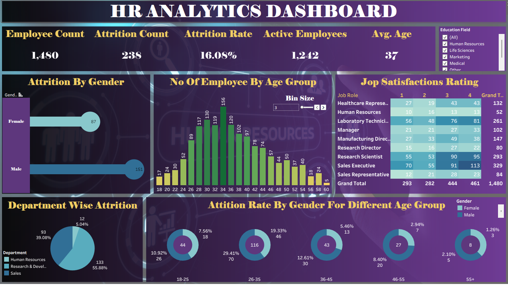

# My First Tableau Dashboard | أول مشروع لي على تابلو 📊

**[English Below]**

سعيد بمشاركة خطوتي الأولى في عالم تصور البيانات (Data Visualization) باستخدام Tableau. تعلمت من خلال هذا المشروع كيفية ربط البيانات، واختيار الرسوم البيانية المناسبة لسرد القصة وراء الأرقام، مع التركيز على تصميم واجهة تفاعلية بسيطة وواضحة تساعد في اتخاذ القرارات.

---

## 🎯 Project Overview
This dashboard marks my first step into professional data visualization. The project demonstrates the power of Tableau in transforming raw data into meaningful insights through clear and interactive design.

## 🚀 What I Learned & Implemented
* **Data Connection:** Learned how to connect and prepare data sources for analysis.
* **Visual Storytelling:** Choosing the right charts (Bar, Line, Maps, etc.) to represent the data accurately.
* **Clean Design:** Focused on a professional, clutter-free layout for better readability.
* **Interactivity:** Added filters and actions to allow users to explore insights dynamically.

## 🔗 Live Demo
*Since GitHub cannot host interactive Tableau files, you can view the fully interactive dashboard here:*
**[👉 Click here to view my Dashboard on Tableau Public](https://public.tableau.com/app/profile/ahmed.ghanem2409/viz/Book1_17650375451910/HRANALYTICSDASHBOARD?publish=yes)**

## 🛠️ Tools Used
* **Tableau Desktop / Public**
* **Data Source:** [Mention your data source here, e.g., Sample Superstore]

---
> *"This is just the beginning. Always learning. Always improving."* 🚀
